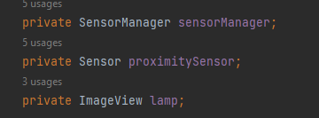
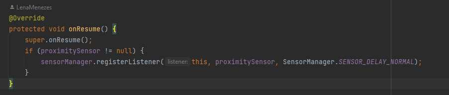
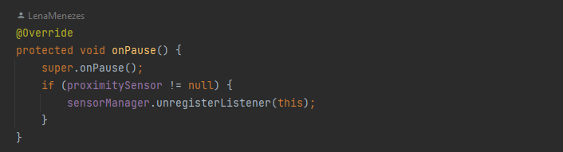
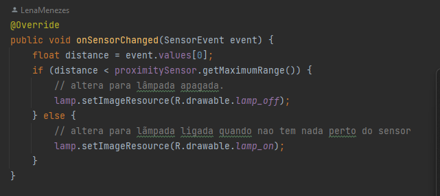
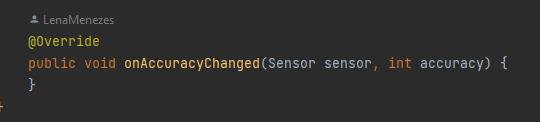

# Sensor_Android
Nome: Guilherme Gasperini Valente

Nome: Helena Menezes Macedo

série: 2 DS

**Intuito**

  Esse nosso trabalho tem o intuito de mostrar um dos sensores que nós escolhemos para fazer, esse sensor, é o sensor de proximidade. Onde iremos mostrar o passo a passo de como fizemos isso.

  **passo 1**
  
  nós decidios não continuar o projeto antigo do app, então de começo. Nós criamos um novo projeto para somente mostrar esse sensor, além da criação do projeto no Android, nós também aderimos a criação de um repositório no GitHub.

  **passo 2**

  o segundo passo foi escolher qual sensor nós iremos pegar, nós optamos pela opção do sensor de proximidade.

  **passo 3**

  agora em baixo terá os videos do nosso sensor.

  **video mostrando pelo celular**

https://github.com/LenaMenezes/Sensor_Android/assets/128048493/11eadf71-7247-4649-97d5-d6db27854e51

**video mostrando pelo Computador**

https://github.com/LenaMenezes/Sensor_Android/assets/128048493/81aa512f-0e78-4581-8199-a238b73e4a51

**explicação do código**

O código representa uma implementação básica de um aplicativo Android que utiliza o sensor de proximidade para controlar a troca de imagem exibida em um ImageView (representando uma lâmpada). Vamos mostrar código passo a passo:

 1. Declaração de Variáveis:
 ---

---
Antes de tudo temos que declarar as variáveis, que são Sensor de proximidade, SensorManager e a ImageView psrs poder exibir a imagem.

2. onCreate:
---

---
Em sequencia chamamos o metodo onCreate quando uma atividade é criada. O layout é definido pelo xml "activity_main" e iniciamos as variáveis que adicionamos no passo anterior, e fazemos a verificação se existe um sensor de proximidade no dispositivo.

3. onResume:
--- 

---
Quando a atividade está prestes a se tornar visível, o método onResume é chamado. Com o 'this' ele cria um registro de ouvinte para o sensor de proximidade com uma taxa de atualização normal que usamos o 'SENSOR_DELAY_NORMAL'.

4. onPause:
---

---
Nesse passo ele faz literamente o contrario, como o nome ja diz 'pause' ele remove o 'ouvinte' do sensor para economizar recursos quando a atividade nao estiver em uso.

5. onSensorChanged:
--- 

---
Basicamente aqui que criamos a logica da distancia e a troca das imagens com a ativação do sensor, ele verifica a distancia se está dentro do alcance do sensor. Dependendo das condições a uma troca de imagens.

6. onAccuracyChanged:
---

---
Esse metodo é chando quendo a precisão do sensor muda, mas esta vazia, nao achamos nessecidade de criar uma logica para ele nesse exemplo.

Esses sao os 6 passos basicos que usamos na criação dessa aplicação do sensor de proximidade.